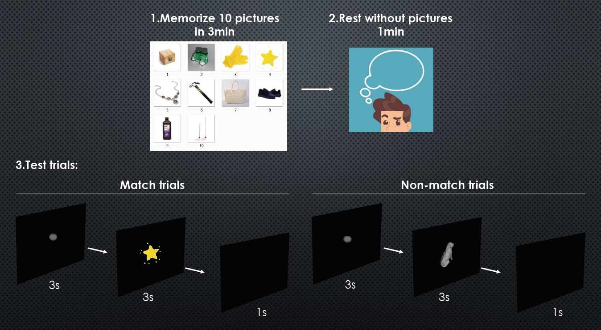

# README

Task:

Original dataset: 19 channels EEG signal for 4 person of 40 or 10 trails

Things we done:

* 截取1s作为输入片段
* 平移信号消除反应时间导致的波峰位置不同，并扩增数据集61倍
* 利用傅里叶（或者小波）提取原始电信号频域特征
* PCA降维上一步的特征以及找到主要通道
* 计算不同人不同频段的注意力能量，结果显示记忆与alpha & theta波段相关
* 尝试KNN Gaussian, SVM, Decision Tree, Random Forest, AdaBoost, Logistic Regression等算法
* 比较不同算法、不同大小数据集、不同维数数据集的算法置信度
* 计算准确率

Conclusion:

扩增之后算法置信度的方差回落到正常范围，稳定性极大提高，准确率稳定在90%左右

